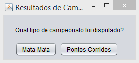
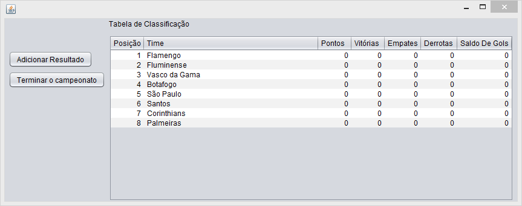
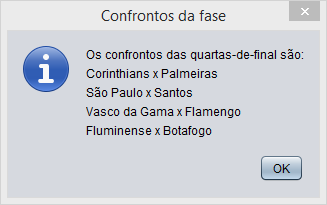
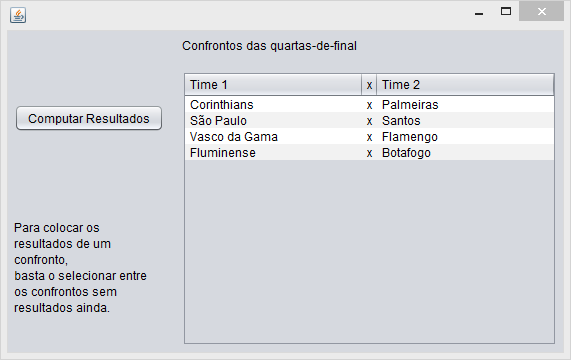

# Gerenciador de Campeonatos

Este software possibilitará o gerenciamento de campeonatos de mata-mata e de pontos corridos.

Com ele é possível:
- Gerar aleatoriamente os confrontos de cada fase de um campeonato mata-mata;
- Registrar os resultados de um campeonato de pontos corridos, além de...;
- Visualizar a tabela de um campeonato em pontos corridos.

## Observações:

- Sobre os campeonatos em mata-mata:
  - O programa considera que são feitos em dois jogos cada duelo, em todas as fases;
  - Caso empate em número de gols feitos, o critério desempate usado é o de quantidade de gols feitos fora de casa;
  - E se continuar igual no critério desempate, o programa considerará que é preciso fazer disputa de pênaltis;
  - Quando há o caso de disputa de pênaltis, o programa pede o placar da disputa, a fim de saber o time classificado.

## Imagens do Software

- Tela inicial

- Tela de campeonato de pontos corridos

- Tela de campeonato mata-mata

## Uso

Para usar a aplicação:

  1. Fazer o download: Duas formas de baixar o sistema:
  
    - Baixando o ZIP diretamente do repositório, ou;
    - Fazendo o clone deste repositório, através do comando:
    git clone https://github.com/rt-oliveira/Gerenciador-de-Campeonatos.git
    
  2. Compilar a aplicação: Para compilar a aplicação, e gerar o executável *jar*, basta dar o seguinte comando na pasta da aplicação:
    `ant`
	
  3. O arquivo *jar* será gerado com esse comando, e;
  
  4. Está pronto para ser usado o Gerenciador de Campeonatos.
  
## Contribuições
  
  - Para contribuir:
    1. Crie um fork deste repositório
    2. Crie uma branch para fazer as alterações
    3. Faça as alterações necessárias
    4. Faça um commit, e envie para seu repositório remoto
    5. Crie um Pull Request

Ps.: Software desenvolvido em 2016 por Rafael Teixeira de Oliveira.

